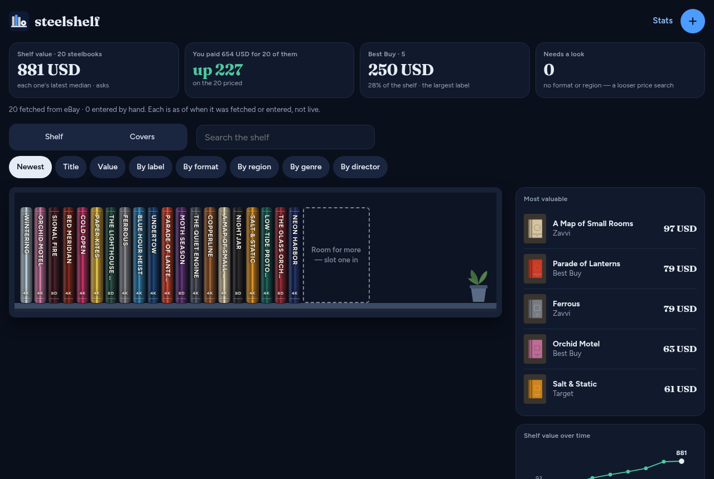
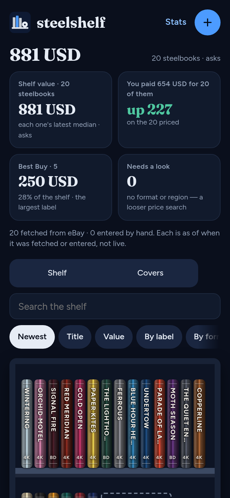
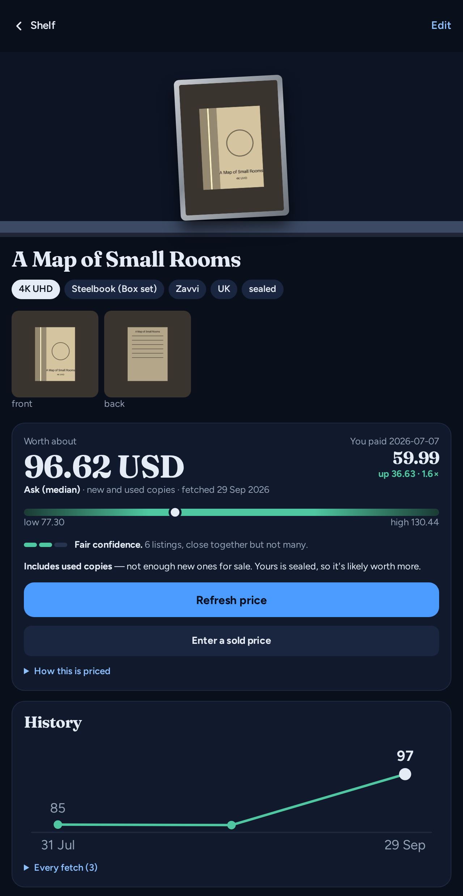
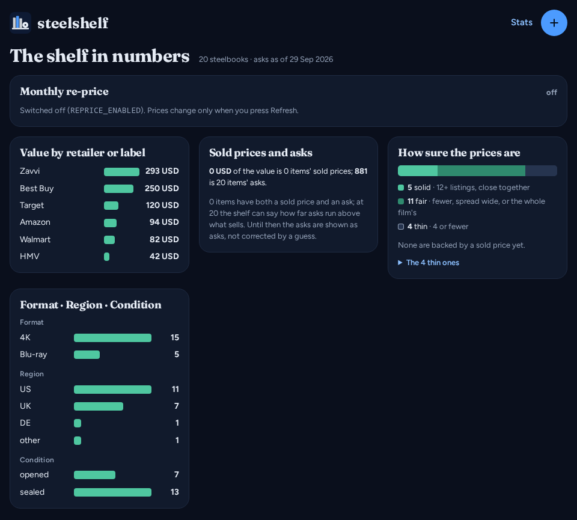
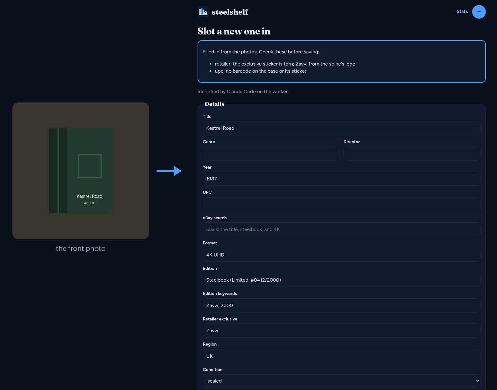

<h1></h1>

[](https://github.com/tydude001/steelshelf/actions/workflows/ci.yml)
[](https://www.python.org/)
[](LICENSE)

Photograph a steelbook, log it in your library, and see what it is worth.
steelshelf is a self-hosted web app for steelbook collectors: point your phone
at a case, let Claude name the edition and the retailer exclusive, and watch
the shelf's value from eBay listings over time. FastAPI + Jinja + HTMX,
SQLite, one Docker container, no CDN.

<p>
  
  
</p>
<p>
  
  
</p>

Every screenshot is the demo shelf (`scripts/demo.py`): invented titles and
drawn cases, since real steelbook art belongs to the studios and artists.
The identify example below is a canned answer in the shape Claude returns,
not a live call.

[Features](#features) · [Quick start](#quick-start) · [Try the demo](#try-the-demo) ·
[Keys](#keys) · [Privacy](#privacy) · [Limitations](#limitations) ·
[Documentation](#documentation) · [Development](#development)

## Features

- 📷 **Capture from your phone.** Front, spine and back, plus an optional
  detail shot — a limited-edition number, a sticker, the bottom of a box set.
  It installs as a PWA.
- 🔎 **Identified for you.** The barcode is decoded locally when there is one;
  Claude reads the rest — title, format, edition, retailer exclusive or
  boutique label, region, condition — and lists what it was unsure of. You
  check the form and save.
- 💲 **Valued from eBay.** Current asks by default, matched to the item's own
  edition, with a range and a confidence cue. Sold prices can be typed in, or
  looked up through an optional sold-comps service.
- 📈 **History that is kept.** Every price is a new row, never an overwrite,
  so the shelf's value is a line over time — beside what you paid. A monthly
  re-price keeps it current.
- 📚 **A shelf that looks like one.** Each case is drawn from its own spine
  photo, grouped by label, format, region, genre or director, with search
  across every field.
- 📊 **Stats.** Value by retailer or label, how sure each price is, and counts
  by format, region and condition.

<p></p>

## Quick start

You need Docker with Compose.

```bash
git clone https://github.com/tydude001/steelshelf.git && cd steelshelf
cp .env.example .env          # set ADMIN_PASSWORD, and the keys you want (§ Keys)
docker compose up -d --build  # http://localhost:8010
```

Then add your first case from the **+** button, on your phone for the camera.
No keys at all still gives you a shelf you fill in by hand; each key adds one
thing (§ Keys). [docs/deploy.md](docs/deploy.md) covers exposure, backups,
health checks and the optional Claude Code worker.

**Upgrading:** `git pull && docker compose up -d --build`. Your shelf lives in
`data/`, which a pull never touches.

## Try the demo

Twenty invented steelbooks with drawn photos and a few months of made-up
prices, no `.env` and no keys:

```bash
docker compose -f docker-compose.demo.yml up --build   # http://localhost:8011
```

The demo is rebuilt on every start and gone when the container is. Writes log
in as `demo` / `demo`; identifying and pricing need keys, so there they fail
and say why. Without Docker, the same shelf from a local `.venv`:

```bash
python -m venv .venv && .venv/bin/pip install -r requirements.txt
.venv/bin/python scripts/demo.py
DATABASE_PATH=demo/steelshelf.db PHOTO_DIR=demo/photos REPRICE_ENABLED=false \
    .venv/bin/uvicorn app.main:app --port 8010
```

## Keys

Only the admin password is required. Each other key switches on one thing:

| Key | Needed | What it adds | Cost |
|-----|--------|--------------|------|
| `ADMIN_USER` / `ADMIN_PASSWORD` | yes | every write, and every call that spends a key | — |
| Anthropic (`ANTHROPIC_API_KEY`) | no | identify from photos; the listing judge | cents per item |
| Claude Code worker (`WORKER_URL`, `WORKER_SECRET`) | no | the same, on your own Claude subscription | your plan |
| eBay (`EBAY_CLIENT_ID`, `EBAY_CLIENT_SECRET`) | no | current asks | free |
| TMDB (`TMDB_API_KEY`) | no | genre and director, and the sorts by them | free |
| SerpApi (`SERPAPI_KEY`) | no, off by default | sold lookups; asks when there is no eBay keyset | 250 searches/month free |
| SoldComps (`SOLDCOMPS_KEY`) | no, off by default | sold lookups, in SerpApi's place | 100 requests/month free |

The two sold-lookup services scrape eBay's sold search, so they only run with
`SOLD_LOOKUP_ENABLED=true`; [docs/pricing.md](docs/pricing.md) says why.

`scripts/set-secrets.sh` prompts for each one (hidden input, Enter keeps the
current value), checks it with a real call, and writes `./.env`, mode 600;
`--remote user@host:/path/to/clone` writes that clone's `.env` over ssh
instead. To add or rotate one key in an existing `.env`, `scripts/set-key.sh
KEY` (same `--remote`) asks for that one, checks it the same way, and leaves
every other line as it was. Keep a copy of every secret in a password
manager. Never in git.

<details>
<summary><b>Getting each key</b></summary>

- **eBay** — a Production keyset.
  1. Sign in at <https://developer.ebay.com> (a developer account, separate
     from the buying account; approval can take a business day).
  2. **Application Keysets** → create one named `steelshelf`, **Production**.
  3. A Production keyset stays disabled until the Marketplace Account
     Deletion requirement is met. steelshelf keeps no eBay user data, so
     take the exemption: **Alerts & Notifications** → "not persisting eBay
     data".
  4. Copy **App ID (Client ID)** and **Cert ID (Client Secret)**. The Dev ID
     is not used. The app mints its own application token.
- **Anthropic** — an API key for the vision step. Not a Claude Pro or Max
  subscription: it doesn't cover API calls, and Anthropic reserves
  subscription sign-in for its own apps
  (<https://code.claude.com/docs/en/legal-and-compliance>).
  1. <https://console.anthropic.com> → **API Keys** → **Create Key**, named
     `steelshelf`. It is shown once — into your password manager before
     closing the dialog.
  2. The account needs credits (**Billing**). The script's check proves the
     key and the model, not the balance.
  3. `ANTHROPIC_MODEL` defaults to `claude-sonnet-5`; the script 404s on a
     model the key can't see.
- **Claude Code worker** (optional) — `WORKER_URL` and `WORKER_SECRET`, the
  bearer secret in the worker machine's `~/.config/steelshelf-worker.env`.
  Run on that machine, the script reads it from there. Setup is in
  [docs/deploy.md](docs/deploy.md); why it exists is in
  [docs/identification.md](docs/identification.md#vision-model--the-decision).
- **SerpApi** (optional) — `SERPAPI_KEY`, and `SOLD_LOOKUP_ENABLED=true` to
  show the sold button and, with no eBay keyset, to fetch asks through it.
  Free account at <https://serpapi.com>, key under **Api Key**. The script
  checks it against the Account API, which spends none of the month's 250
  searches.
- **SoldComps** (optional) — `SOLDCOMPS_KEY`: with it, the sold button asks
  SoldComps instead of SerpApi (asks never do), still only while
  `SOLD_LOOKUP_ENABLED` is on. Free account at <https://sold-comps.com>, 100
  requests a month, one per lookup. The script checks the key with a search
  that has no keyword, which the API refuses before it counts.
- **TMDB** (optional) — `TMDB_API_KEY`: a free key from
  <https://www.themoviedb.org/settings/api>. Either credential TMDB issues
  works — the v3 API key (sent as `api_key`; httpx's request log is held at
  WARNING, so it stays out of the logs) or the v4 read access token (a
  bearer). Unset, nothing is looked up and both are typed on the edit form.
  The script checks it against `/authentication`. With a key set, every
  page's footer carries TMDB's logo and "This product uses the TMDB API but
  is not endorsed or certified by TMDB.", as their terms require.
- **Admin** — `ADMIN_USER` / `ADMIN_PASSWORD`, HTTP Basic for every write and
  third-party call. The script generates the password if you press Enter, and
  the app logs a warning at startup while it is still `changeme`.

</details>

## Privacy

Your photos and your database stay on your machine. Photos leave it only when
you press **Identify**, to Anthropic's API or to your own Claude Code worker —
and, with `JUDGE_LISTINGS` on, the front photo and the item's fields go the same
way with each price fetch, for the listing judge.
Titles go to TMDB for genre and director; titles and UPCs go to eBay (and
SerpApi, if you switch sold lookups on) for prices. Nothing is sent anywhere
else, and there is no telemetry.

## Limitations

- **One collection, one admin, no accounts.** Reads are open: every page and
  photo answers anyone who can reach the port, and Basic auth is plain text on
  plain HTTP. Run it on a LAN or a tailnet, not the open internet
  ([docs/deploy.md](docs/deploy.md) has the reverse-proxy route).
- **Prices are ebay.com's, in US dollars.** A UK or German edition is priced
  by what it fetches there.
- **Asks, not sales, by default.** eBay no longer opens its sold data to hobby
  developers, and a median ask usually runs above what sells; the pages say
  which a price is. Sold prices come from typing them in or from a scraping
  service you switch on yourself.
- **Identifying needs Claude.** Without an API key or a worker, you type each
  case's details in.
- **Built for steelbooks.** Searches add "steelbook", and the shelf assumes a
  case's proportions.

## Documentation

- [docs/identification.md](docs/identification.md) — capture, the barcode and
  vision steps, drafts, and why Claude does the vision.
- [docs/pricing.md](docs/pricing.md) — what an item is worth, matching
  listings to the edition, the monthly re-price, and the pricing-source
  decision.
- [docs/shelf.md](docs/shelf.md) — sorts, search, TMDB, the value chart,
  spine detection, `/stats`.
- [docs/architecture.md](docs/architecture.md) — every module and directory.
- [docs/deploy.md](docs/deploy.md) — running it for real: exposure, backups,
  health checks, the worker.

## Development

App dependencies live in the Docker image; for tests and a dev server, a
local `.venv`:

```bash
python -m venv .venv
.venv/bin/pip install -r requirements.txt -r requirements-dev.txt
.venv/bin/python -m ruff check . && .venv/bin/python -m pytest -q
cp .env.example .env
.venv/bin/uvicorn app.main:app --reload --port 8010
```

The suite needs no network and no keys. [CONTRIBUTING.md](CONTRIBUTING.md)
has the rules a pull request is checked against.

## Licence and credits

[MIT](LICENSE). Security reports: [SECURITY.md](SECURITY.md).

Fraunces and Figtree are vendored under the SIL Open Font License
(`app/static/fonts/`). Film data comes from TMDB: this product uses the TMDB
API but is not endorsed or certified by TMDB. steelshelf is not affiliated
with eBay, TMDB, SerpApi, SoldComps or Anthropic. SteelBook® is a trademark of
Scanavo, used here only to describe the cases the app catalogues.
